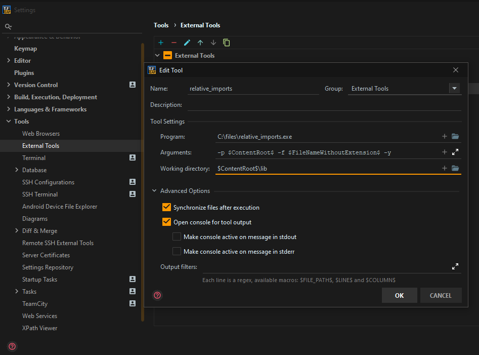

# relative_imports

An IDE agnostic tool to automatically convert your Flutter/Dart projects self-package (package:myproject) imports to relative imports (../myfiles.dart).   

If your IDE can perform "on-save" actions, macros, or hotkey triggered commands to the terminal with arguments, you should be able to automate on save, just as you would with dartfmt.  

 
If, when your IDE automatically adds imports to your local project files, they are brought in as package imports like this:
```dart
import 'package:relative_imports/file1.dart';
import 'package:relative_imports/folder1/file2.dart';
import 'package:relative_imports/folder2/file3.dart';
 ```
They will be converted to the proper local relative imports like this:
```dart
import 'file1.dart';
import 'folder1/file2.dart';
import '../folder2/file3.dart';
 ```

---
### Examples:  
Configuration for IntelliJ or Android Studio:



Example usage via command line:
```
C:\tools\relative_imports.exe -p C:\projects\my_project\pubspec.yaml -f MyFilenameWithoutExtension -y
```

---
### Arguments:  
```
 file-name        (-f)  The name of the .dart file in which to convert imports to relative (do not include extension)
 directory-path   (-d) 1) Project root directory (1 or 2 Required)
 pubspec-location (-p) 2) The path to your projects pubspec.yaml (1 or 2 Required)
 auto-apply       (-y) If -y argument is set, automatically apply all import changes. Otherwise you will be prompted to confirm the changes        
 verbose          (-v) If -v argument is set, additional log messages will be shown
```

---
#### Notes:  
To help with cross-platform compatibility, glob is used for file matching and there was issue on Windows trying to 
pass the absolute path of the intended target file in which the imports were to be converted. Due to this, 
just the filename without the .dart extension is passed in using the projectroot/lib folder as 
the working directory.   

Doing it this way has been working well, but I am not sure if it will become an issue with very large projects 
with hundreds/thousands of files. If so, I will go about it a different way and make sure the direct path to the 
intended target file is used, instead of matching by filename.

I will also be doing some "best-practice" refactoring.

